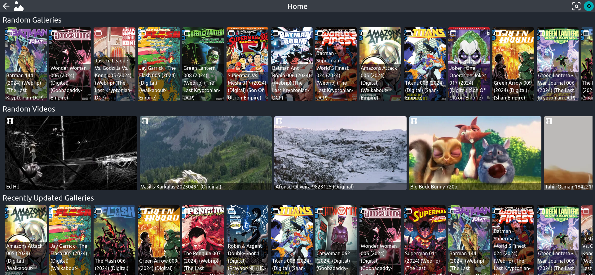

---
# https://vitepress.dev/reference/default-theme-home-page
layout: home

titleTemplate: false

hero:
  name: Jarklin
  text: A Free Software Media System
  tagline: Currently under Development and not stable
  actions:
    - theme: alt
      text: Screenshot
      link: /screenshot
    - theme: brand
      text: Guide
      link: /guide/what-is-jarklin
    - theme: alt
      text: Config
      link: /config/
  image:
    src: /jarklin.svg
    width: 512
    height: 512

features:
  - title: Free
    icon: 💵
    details: This Software is open source which means you don't have to pay to use it.
        Jarklin would still appreciate if you could donate, but such a system is not available yet.
  - title: Protected
    icon: 🔒
    details: Media served with Jarklin is Protected with a user-system.
        This prevents unwanted access to your media.
  - title: Easy to Set-Up
    icon: ⚙️
    details: Jarklin offers a convenient command-line wizard script for the Installation. Also there are additional ways to install it like .tgz or with Docker
---

<VPTeamPage>
  <VPTeamPageTitle>
    <template #title>
        
    </template>
  </VPTeamPageTitle>
</VPTeamPage>

<VPTeamPage>
  <VPTeamPageTitle>
    <template #title>
      Jarklin Team
    </template>
    <template #lead>
      The developers of Jarklin are proud to be part of the project.
      Members with exceptional contribution are featured below.
    </template>
  </VPTeamPageTitle>
  <VPTeamMembers
    size="small"
    :members="members"
  />
</VPTeamPage>
